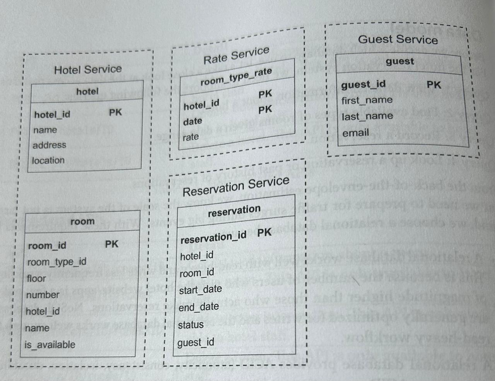
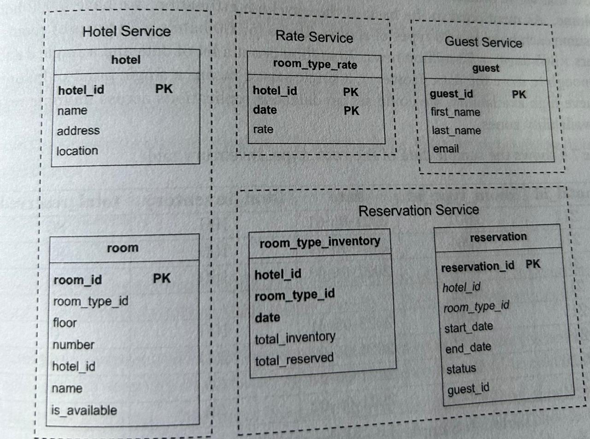
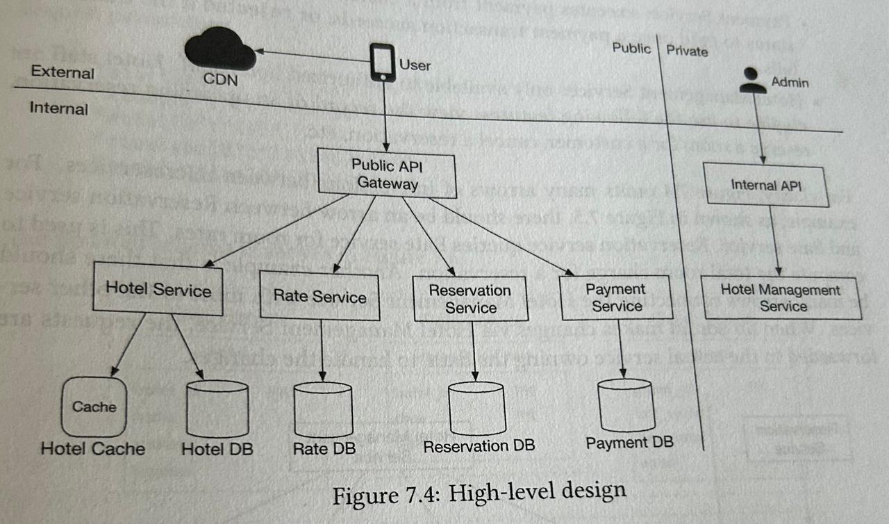
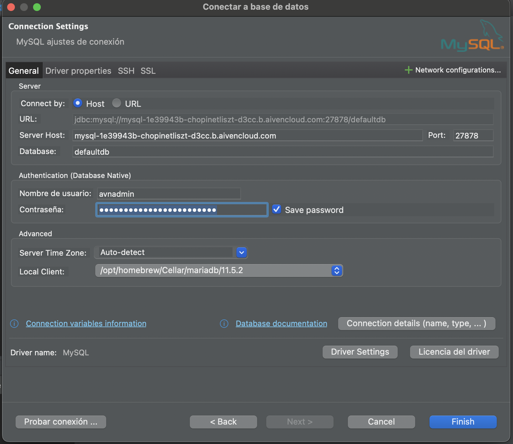
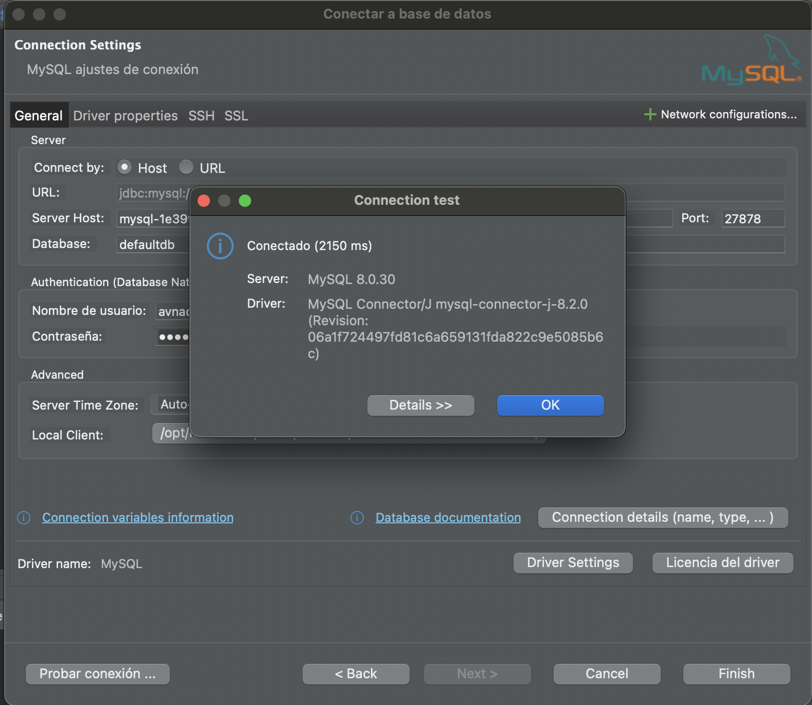
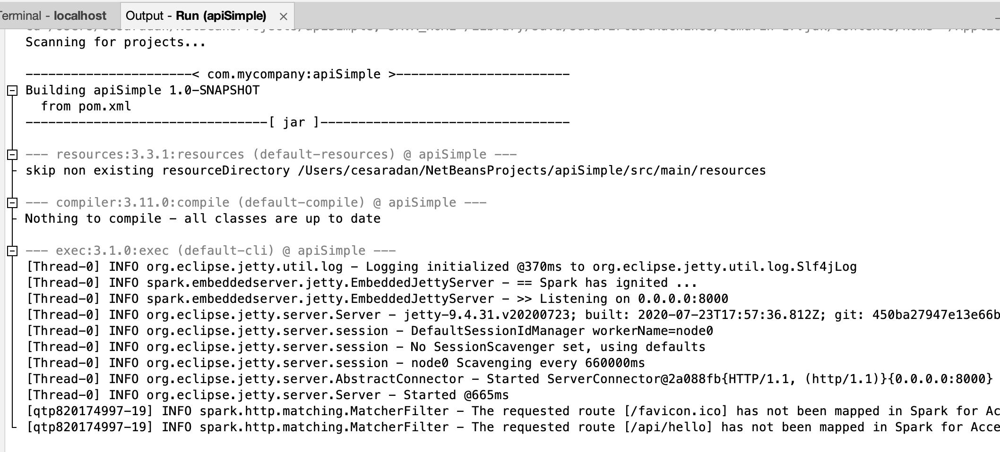
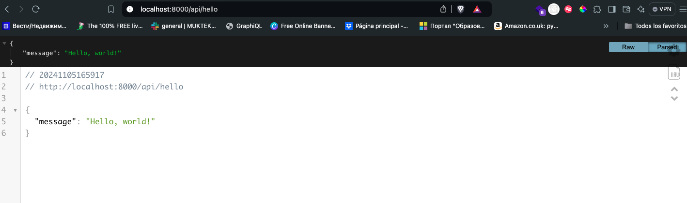
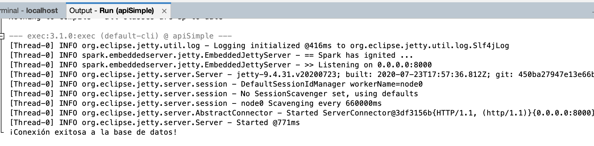

# Proyecto 5 - Semestre programacion en Java

## Planeacion y administracion

## Diseno
Destacar los siguientes puntos:
1. Comprension del problema (definir problema y objetivos)
2. Investigacion de campo (encuestas, entrevistas, grupos focales)
3. Analisis de la competencia(buscar apps similares)
4. Mapeo de la experiencia de usuario (UX) - User Journey.
5. Creacion de personas y mapeo de empatia.
6. Redifinicion del problema.
7. Ideacion y Brainstorming(Miro)
8. User stories y escenarios de uso.
9. Flujo de usuario (User flow)
10. Wireframes de baja fidelidad
11. Prototipo de prueba
12. Pruebas de usabilidad iniciales.

Usaremos Figma para crear el sistema de diseno y la parte visual de la aplicacion

Hacer el research del proyecto
Generar mockups
Crear prototipos
Generar Wireframes

Buscar conceptos como User journey, creacion de personas y mapeo de empatia.

## Desarrollo
Crearemos una app simple en front end y backend.

### Frontend
Usaremos React en codesandbox: https://codesandbox.io/dashboard/recent 
Crear un proyecto React usando JS simple, evitar la opcion que dice React(TS).

### Backend
Crear y documentar el High Level Design. Usando Lucid Chart y Miro.
Ejemplo: App sistema de reservacion de hotel

1. API Design
Hotel  APIs

| API                  | Detalles                                                                        | 
| -------------------  | ------------------------------------------------------------------------------- | 
| GET /v1/hotels/ID    | Obtener informacion detallada sobre el hotel                                    | 
| POST /v1/hotels/ID   | Anadir un nuevo hotel. Esta API solo esta disponible para el staff del hotel.   | 
| PUT /v1/hotels/ID    | Actualizar la informacion del hotel. Solo para el staff del hotel               | 
| DELETE /v1/hotels/ID | Borrar un hotel. Esta API solo esta disponible para el staff del hotel          | 

Habitacion APIs
| API                           | Detalles                                                                        | 
| ------------------------      | ------------------------------------------------------------------------------- | 
| GET /v1/hotels/rooms/ID       | Obtener informacion detallada sobre la habitacion.                              | 
| POST /v1/hotels/ID/rooms      | Anadir una habitacion. Esta API solo esta disponible para el staff del hotel.   | 
| PUT /v1/hotels/ID/rooms/ID    | Actualizar la informacion de la habitacion. Solo para el staff del hotel        | 
| DELETE /v1/hotels/ID/rooms/ID | Borrar una habitacion. Esta API solo esta disponible para el staff del hotel    | 


Reservacion APIs
| API                           | Detalles                                                                        | 
| ------------------------      | ------------------------------------------------------------------------------- | 
| GET /v1/reservations          | Obtener los detalles de la reservacion de un usuario logeado.                   | 
| GET /v1/reservations/ID       | Obtener informacion detallada sobre la reservacion.                             | 
| POST /v1/reservations         | Hacer una nueva reservacion                                                     | 
| DELETE /v1/reservations/ID    | Cancelar una reservacion                                                        | 

Disenar el parametro de la reservacion. Ejemplo: POST v1/reservations

```json
{
   "startDate": "2021-04-28",
   "endDate": "2021-04-30",
   "hotelID": "245",
   "roomID": "U12354673389",
   "reservationID: "13422445"
}
```

3. Data Model
   Disenar las querys
   a. Ver informacion detallada del hotel
   b. Encontrar tipos de habitaciones disponibles dado un rango de fecha.
   c. Hacer una resrvacion
   d. Buscar una reservacion o listas pasadas de reservaciones.

   Una base de datos relacional funciona.
   
Ejemplo:


Diseno mejorado


Finalmente se disenara como seria un High-level design en el backend con springboot y Java. Con fines de aprendizaje.
Solo sera el diagrama final de como funcionaria el proyecto en un entorno verdadero.



Netbeans, haremos un backend con Java y mysql

mysql

1.Entrar a: https://aiven.io/ 
2. Crear una cuenta
3. Crear una base de datos mysql
4. Escoger siempre todo gratis.

Se vera como:


Usaremos los datos para conectarnos a la app y hacer consultas en DBeaver

Netbeans
1. Crear proyecto Java with Maven -> Java Application
2. Next -> Nombrar por ejemplo: API o SimpleAPI -> Finish
3. Anadir las dependencias:
   ```xml
    <dependencies>
        <dependency>
            <groupId>com.sparkjava</groupId>
            <artifactId>spark-core</artifactId>
            <version>2.9.3</version>
        </dependency>
        <dependency>
            <groupId>com.google.code.gson</groupId>
            <artifactId>gson</artifactId>
            <version>2.8.8</version>
        </dependency>
        <dependency>
            <groupId>org.slf4j</groupId>
            <artifactId>slf4j-simple</artifactId>
            <version>1.7.36</version>
        </dependency>
        <dependency>
            <groupId>mysql</groupId>
            <artifactId>mysql-connector-java</artifactId>
            <version>8.0.25</version>
        </dependency>
    </dependencies>
   ```
   
4. En el archivo principal : src->main->java->com->mycompany->apisimple->ApiSimple.java, dependera de como se llame la clase principal.
```java
package com.mycompany.apisimple;
import static spark.Spark.*;

import com.google.gson.Gson;

public class ApiSimple {
public static void main(String[] args) {
        port(8000); // Define el puerto para el servidor

        Gson gson = new Gson();

        get("/api/hello", (req, res) -> {
            res.type("application/json");
            return gson.toJson(new Message("Hello, world!"));
        });

        get("/api/data", (req, res) -> {
            res.type("application/json");
            return gson.toJson(new int[]{1, 2, 3, 4});
        });
    }

    static class Message {
        private String message;

        public Message(String message) {
            this.message = message;
        }

        public String getMessage() {
            return message;
        }
    }
}
```

Conexion con DBeaver
Paso 1. Dar click en el boton de nueva conexion.
Paso 2. Conectar y se vera algo como:



y llenar los campos con los datos obtenidos en aiven. Quedara:


Dar el boton de RUN(play) para probar que todo funcione
Ver una salida en Netbeans:


y en el navegador: http://localhost:8000/api/hello 


Conectar la base de datos a Netbeans

Dentro de util anadir dos archivos 
CORSConfig.java
```Java
package com.mycompany.apisimple.util;
import static spark.Spark.*;

public class CORSConfig {
    public static void enableCORS(String origin) {
        options("/*", (req, res) -> {
            String accessControlRequestHeaders = req.headers("Access-Control-Request-Headers");
            String accessControlRequestMethod = req.headers("Access-Control-Request-Method");

            // Permitir el acceso a todas las solicitudes desde el origen proporcionado
            res.header("Access-Control-Allow-Origin", origin);
            res.header("Access-Control-Allow-Methods", "OPTIONS, GET, POST, PUT, DELETE");
            res.header("Access-Control-Allow-Headers", "Content-Type, Authorization, X-Requested-With, X-Custom-Header");
            res.header("Access-Control-Allow-Credentials", "true");
            res.header("Access-Control-Max-Age", "3600");

            return "OK";
        });

        // Configurar las solicitudes HTTP reales (GET, POST, PUT, DELETE, etc.)
        before((req, res) -> {
            res.header("Access-Control-Allow-Origin", origin);
            res.header("Access-Control-Allow-Methods", "OPTIONS, GET, POST, PUT, DELETE");
            res.header("Access-Control-Allow-Headers", "Content-Type, Authorization, X-Requested-With, X-Custom-Header");
            res.header("Access-Control-Allow-Credentials", "true");
        });
    }
}
```
y Database.java

```Java
package com.mycompany.apisimple.util;

import java.sql.Connection;
import java.sql.DriverManager;
import java.sql.SQLException;

public class Database {
    private static final String URL = "tu_service_url";
    private static final String USER = "tu usuario";
    private static final String PASSWORD = "tu_contrasena";

    public static Connection getConnection() throws SQLException {
        return DriverManager.getConnection(URL, USER, PASSWORD);
    }
}
```
Anadir este codigo en la clase principal:

```Java
      CORSConfig.enableCORS("*");
        
        try (Connection connection = Database.getConnection()) {
            if (connection != null) {
                System.out.println("¡Conexión exitosa a la base de datos!");
            }
        } catch (SQLException e) {
            System.out.println("Error al conectar a la base de datos: " + e.getMessage());
        }
```
*** Checar las rutas de importacion.

Mensaje final al correr el programa si todo esta bien

Problemas:
1. Abrir terminal: window->IDE Tools->Terminal
2. Si es un problema con el puerto
3. Correr estos dos comandos en orden: 
## Pruebas
Requerimientos por individuo

1. Cada integrante debera tener una cuenta en Github y poner la informacion que se vaya indicando dentro de un(os) repositorios.
2. Tener una cuenta Trello y tener acceso al Tablero del equipo
3. Cada estudiante tendra un rol asignado

## Investigar

Planeacion y seguimiento

1. Crear tareas, un sprint de 2 semanas.
2. Llevar el seguimiento de las tareas que se van realizando.
   
Diseno
Webflow, Figma y Miro
Crear un flujo de trabajo y establecer fechas.
   
Frontend
css properties, html tags, semantic html, javascript (async/await, promesa, array methods, string methods).
Y aprender lo que se vaya viendo en clase.

React:
Que es state?
Que son las props?
VDOM y consiliacion
Composicion en React
Hooks: useState, useContext, useEffect, useCallback, useMemo, useReducer(opcional)

Backend

Que es springboot?
Que es un controlador, un modelo y un endpoint y rutas y como se hace?

Usar chatGPT y usar el prompt: Dame el concepto de .... con ejemplos de codigo en ....
Probar los ejemplos en las herramientas vistas en clase.

Plan de trabajo (Sugerido)
Semana 1. 
Estructura

### Project Manager (PM)
Coordinar la comunicacion y el seguimiento de las tareas. Establecer prioridades, y asegura
que cada miembro entiende sus prioridades y responsabilidades, asi como sus plazos.
Definir los sprints. 
Creacion de todas las tareas y asignacion y seguimiento usando Trello.
Saber el rol de cada uno de los integrantes del equipo y asegurarse en como puede cumplirlos. Y elaborar e investigar planes de contingencia.

### UX Designer
Enfocarse en la investigacion y creacion de prototipos basicos.
Prototipado en Webflow. Aunque no es el diseno final. Ayudara a mostrar los flujos de usuario y permitira realizar pruebas bascias de navegacion y usabilidad.
Este prototipo servira tambien como referencia para el equipo de frontend.
Mientras ellos configuran los primeros componentes.

Completar la investigacion con entrevistas o encuestas si faltans.

Mapeo de usuarios (personas y journey maps) y definir los flujos de usuario (user flows). Deben quedar porque guiaran el desarrollo.
Anadir nombre de la aplicacion. 

### Frontend y Backend
Empezar la planeacion y estructurar el proyecto.
Decidir que tipo de componentes se usaran, configurar el proyecto para su desarrollo.
Repositorios, codesandbox y Base de datos, asi como la base de datos.
Investigar conceptos y realizar algunos ejercicios. Probar que puedan correr estos entornos tanto en el laboratorio, como en casa.

Semana 2.
### PM
Crear el roadmap dividiendo los sprints por semana.
Crear tarjetas especificas como investigacion, wireframes, pruebas de usabilidad, desarrollo frontend
desarrollo backend, pruebas iniciales, y cualquier tarea adicional.

Anadir etiquetas de prioridad y fechas limite para facilitar el seguimiento.
Hacer revisiones periodicas de 10-15 mins, comunicarse via telefonica, mensajeria o videochat.

### UX
Basado en la retroalimentacion de la priemra semanas. Ajustar el prototipo de Webflow para merjorar la usabilidad. 
Crear wireframes en Figma. 
Compartir los componentes de diseno con el equipo de desarrollo.

### Frontend y Backend
Crear componentes base reutilizables. Ejemplos: botones, forms, layouts, etc.
Usar el prototipo de webflow para guiar la estructura.

Backend
Configurar las bases de datos y la API inicial para manejar datos clave como usuarios, encuestas de bullying, denuncias.

** Al finalizar la segunda semana. Intentar pruebas internas con los miembros del equipo. Crear pruebas de usabilidad.
Revisar errores o posibles ajustes de ultima hora basados en los resultados de las pruebas de usabilidad.

Semana 3.
### PM
Analizar puntos criticos que deben de estar listos para la demo. Organizar al equipo para que puedaabordar los pendientes.

### UX
Ajustar detalles visuales en Figma para asegurar consistencia en el diseno, y optimizar las pantallas en el prototipo de Webflow.

### Frontedn y Backend
Asegurar que los puntos criticos esten funcionando.
Realizar ajustes de la interfaz como botones, tipografia, y empezar la elaboracion de una demo.

Preparar una pequena presentacion con la demo. Incluirla en la presentacion ya hecha.
Incluir mejoras a futuro, diseno que se puede usar para mostrar esta parte(Figma o Webflow) o se pueden anadir otro tipo de sistemas o tecnologias 
que en conjunto puedan resolver varios de estos problemas.

Campana de Marketing para promover la App y/o producto.

** Realizar pruebas de usabilidad internas. Prueba rapida

Semana 4.
Crear una demo final entre todo el equipo.
Incluir mejoras a futuro, diseno que se puede usar para mostrar esta parte(Figma o Webflow) o se pueden anadir otro tipo de sistemas o tecnologias 
que en conjunto puedan resolver varios de estos problemas.

Campana de Marketing para promover la App y/o producto.

Recursos
### PM

### UX

### Frontend y Backend


Recursos extras
### PM

### UX

### Fronteend y Backend
